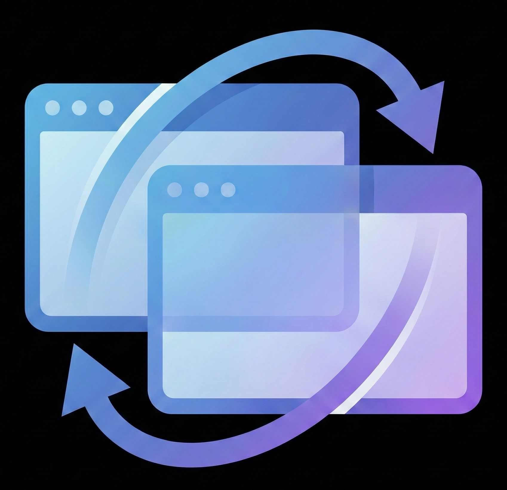
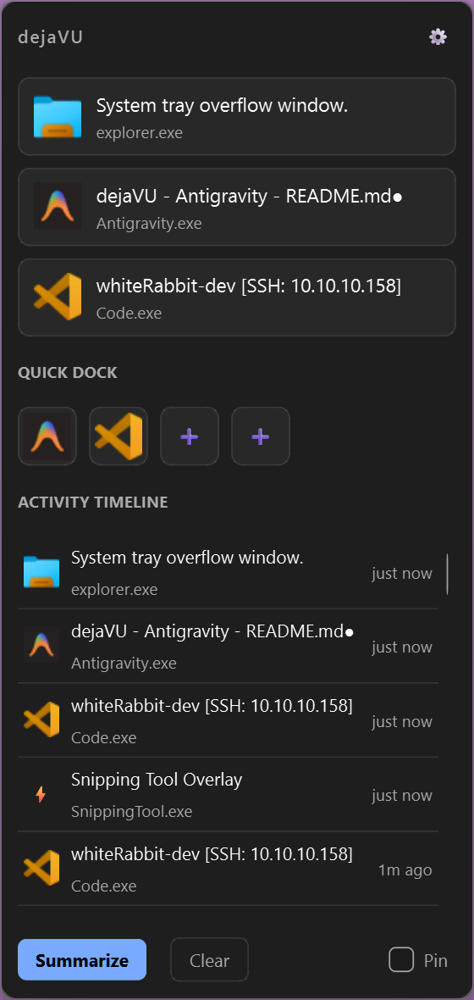
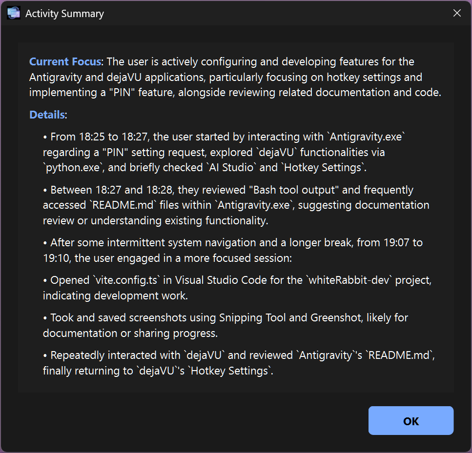

<p align="center">
  
</p>

# dejaVU

**"What the hell was I doing?"** — You ever switch windows to look for something and forget what you were just doing? You just sit there spaced out waiting for it to come back to you? dejaVU is a Windows desktop app that tracks your activity, lets you jump back to any window, and summarizes what you've been working on with AI.

## ✨ Features

- **Window History** — Click or use hotkeys to instantly restore that window. You mouse TELEPORTS to the window you selected so there is no way you get lost.
- **AI Summary** — Get a quick summary of what you've been working on
- **Global Hotkeys** — Switch windows without touching your mouse. Recall the panel with `Ctrl+Alt+A` (configurable)
- **Pin Favorites** — Keep your most-used apps one click away
- **Always on Top** — Stays visible while you work
- **Local LLM Support** *(coming soon)* — Run analysis locally with Ollama or any OpenAI-compatible endpoint for full privacy

## 📸 Screenshots

<p align="center">
  
</p>

The main panel shows your **Focus Cards** (top 3 windows you've been working with), a **Quick Dock** for pinned apps, and a full **Activity Timeline** of recent window switches. Click any item to teleport back.

<p align="center">
  
</p>

Hit **Summarize** to get an AI-generated breakdown of what you've been working on — helpful forremembering where you left off.

## 🛠️ Setup

1. Install Python 3.10+
2. Create a virtual environment:
   ```bash
   # Using venv
   python -m venv .venv
   .venv\Scripts\activate  # Windows

   # Or using uv (faster)
   uv venv
   .venv\Scripts\activate
   ```
3. Install dependencies:
   ```bash
   pip install -r requirements.txt
   # Or with uv: uv pip install -r requirements.txt
   ```
4. Add your Gemini API key to `~/.dejavu/settings.json`:
   ```json
   {
     "gemini_api_key": "your_key_here"
   }
   ```
   > The app will create this folder on first run. You can also use a `.env` file with `GEMINI_API_KEY=your_key_here` for backward compatibility.

## ▶️ Run

```bash
python ActivityMonitor.pyw
```

That's it. The watcher runs automatically in the background.

## 📦 Build Executable

> ⚠️ **Note:** The build script is configured for the developer's environment. You may need to adjust paths or dependencies for your system.

```powershell
.\build_exe.ps1
```

The executable will be in `dist\dejaVU.exe`.

## ⌨️ Hotkeys

| Action | Hotkey |
|--------|--------|
| Show/Hide Panel | `Ctrl+Alt+A` |
| Cycle History | `Ctrl+Alt+Space` |
| Focus Card #1-3 | `Ctrl+Alt+1/2/3` |
| Pinned App #1-3 | `Ctrl+Alt+Shift+1/2/3` |

Customize hotkeys via the ⚙ Settings button.

## 📁 Project Structure

```
dejaVU/
├── ActivityMonitor.pyw    # Entry point
├── src/
│   ├── gui.py             # Main app (watcher embedded)
│   ├── llm_summarizer.py  # AI summaries
│   ├── hotkey_*.py        # Hotkey system
│   ├── paths.py           # Config file paths (~/.dejavu/)
│   └── ...
├── dejavu.ico             # App icon
└── requirements.txt
```

Settings are stored in `~/.dejavu/` (your user home folder).

## Privacy Notice

The **Summarize** feature sends your window titles and app names to Google's Gemini API. This data may include project names, file paths, or other info visible in your window titles. Use caution if you're working with sensitive or confidential information.

Local LLM support (via Ollama) is planned for users who want to keep everything on-device.

## Support

If you find this useful, consider buying me a coffee:

Created along with by buddy Claude.

[](https://buymeacoffee.com/zheroz00)

## License

MIT